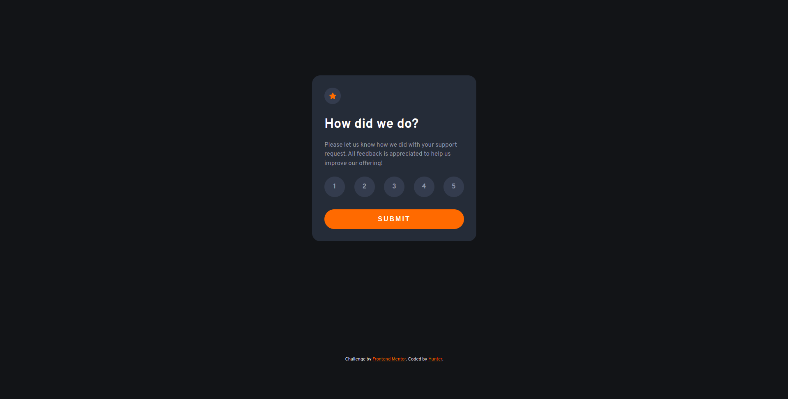
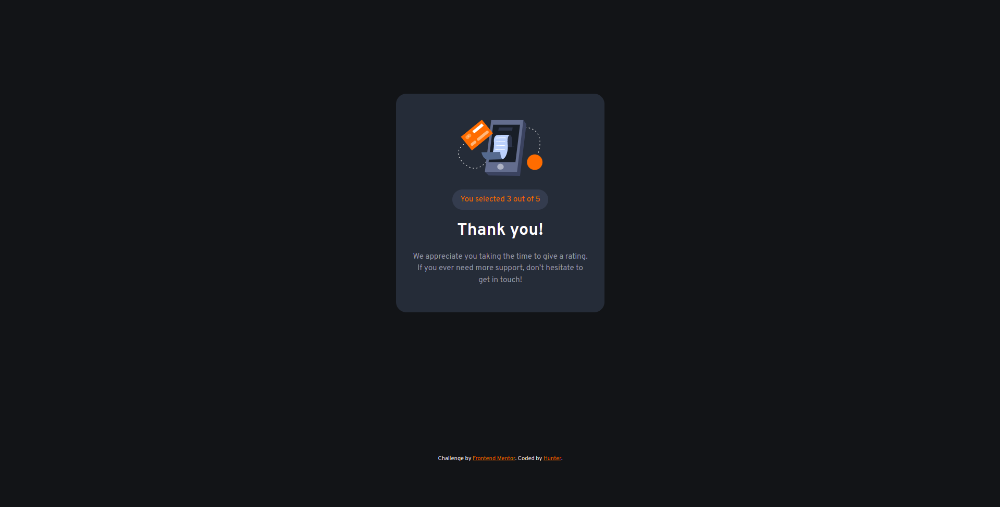

# Frontend Mentor - Interactive rating component solution

This is a solution to the [Interactive rating component challenge on Frontend Mentor](https://www.frontendmentor.io/challenges/interactive-rating-component-koxpeBUmI). Frontend Mentor challenges help you improve your coding skills by building realistic projects. 

## Table of contents

- [Overview](#overview)
  - [The challenge](#the-challenge)
  - [Screenshot](#screenshot)
  - [Links](#links)
- [My process](#my-process)
  - [Built with](#built-with)
  - [What I learned](#what-i-learned)
  - [Continued development](#continued-development)
- [Author](#author)

## Overview

### The challenge

Users should be able to:

- View the optimal layout for the app depending on their device's screen size
- See hover states for all interactive elements on the page
- Select and submit a number rating
- See the "Thank you" card state after submitting a rating

### Screenshot

- Select and submit a number rating


- "Thank You" card after submitting


### Links

- Solution URL: [My solution](https://github.com/huntoor/interactive-rating-component-main)
- Live Site URL: [Github Page](https://huntoor.github.io/interactive-rating-component-main)

## My process

### Built with

- Semantic HTML5 markup
- CSS
- Flexbox
- Javascript
- JS DOM manipulation

### What I learned

I've learned how to use "forEach" loop insted of using "for" or "for of" loop

```js
rattingBtns.forEach(rattingBtn => {
  rattingBtn.addEventListener("click", () => {
    error.classList.add("hidden");
    removeActive();
    rattingBtn.classList.add("active");
    ratting = rattingBtn.dataset.value;
  })
});
```

### Continued development

I want to focus more on javascript and learn more efficient ways to write code, and I also want to learn how to write clean code.

"Never Stop Learning"

## Author

- Github - [huntoor](https://github.com/huntoor)
- Frontend Mentor - [@huntoor](https://www.frontendmentor.io/profile/huntoor)